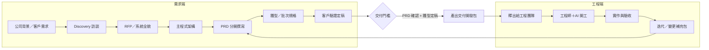

# 需求到交付包｜生命週期與流程總覽

本文件為**從最前端需求、公司背景到釋出協助開發包給工程師以 AI 協作開發**之單一流程總覽，標註各階段產出、目錄、手off 責任與關鍵文件，便於一次檢視是否有遺漏與建議規範。與 [協同開發｜文件治理流程](協同開發_文件治理流程.md)、[公司專案標準規範｜需求與開發協作](公司專案標準規範_需求與開發協作.md) 併用。

---

## 1. 生命週期總覽圖

---

## 2. 各階段對照表

| 階段 | 產出物 | 放置目錄 | 責任 | 手off／下一階段 |
| :--- | :--- | :--- | :--- | :--- |
| **公司背景／需求** | 客戶資料卡、產業／組織背景摘要 | `01_Discovery/` | 需求方 | Discovery 訪談之輸入 |
| **Discovery 訪談** | 訪談紀錄、現況 As-Is、痛點 | `01_Discovery/` | 需求方 | 分析階段輸入；可產出 RFP 初稿 |
| **RFP／系統全貌** | 系統目標、階段、主作業分類、主程式清單（代號＋簡述） | `02_Analysis/` | 需求方 | 客戶確認後 → 主程式架構 |
| **主程式架構** | 主程式代號、程式名稱、所屬作業、簡要說明；子程式預留 | `02_Analysis/` | 需求方／AI | 工程師**先取得**；→ 分開撰寫 PRD |
| **程式編碼原則** | 模組代號、主程式／子編碼、權限表、命名（TABLE/API/雛型） | `internal_docs/` | 公司標準 | 全階段引用；見 [程式編碼原則｜共用規範](程式編碼原則_共用規範.md)、[模組與程式代碼編碼原則](模組與程式代碼編碼原則.md) |
| **PRD（分開）** | 每主程式＋子程式一 PRD；四項必備（代碼、權限矩陣、情境、欄位對照表） | `02_Analysis/` | 需求方／AI | 與雛型／批次規格對齊後 → 交付門檻 |
| **雛型／批次規格** | 雛型 HTML、操作步驟；或批次規格（觸發、輸入、處理、輸出） | `02_Analysis/`、`docs/prototype/` | 需求方／AI | 客戶驗證定稿 → 交付門檻 |
| **交付門檻** | — | — | 需求方 | **PRD 確認**＋**雛型／規格定稿**後才產出交付包 |
| **產出交付開發包** | 精簡包：README、規格、雛型、附錄（開工指引、schema、API、依賴） | 交付包目錄／壓縮包 | 需求方／AI | 釋出給工程團隊（Tag／授權） |
| **釋出協助開發包** | 授權 Repo、Tag、或壓縮包；工程團隊在**自有專案**開發 | — | 需求方 | 工程師＋AI 開工；見 [開發團隊_AI開發指引](開發團隊_AI開發指引.md) |
| **驗收與迭代** | 驗收條件檢核、需求變更單、變更補充包 | `02_Analysis/`、交付包更新 | 需求方＋工程團隊 | 回饋→更新 PRD／雛型→新交付包 |

---

## 3. 關鍵文件與範本索引

| 用途 | 文件／範本 | 說明 |
| :--- | :--- | :--- |
| **公司背景／客戶** | `00_Templates/Tpl_客戶與專案背景.md`（若已建立） | 客戶資料卡、產業背景；補足 Discovery 輸入 |
| **訪談** | `00_Templates/Tpl_Discovery_Note.md` | 訪談紀錄 |
| **RFP** | `00_Templates/Tpl_RFP_系統全貌.md` | 系統全貌、階段、主程式清單 |
| **主程式架構** | 依 [PRD_拆分與交付單元規則](standards/PRD_拆分與交付單元規則.md) 產出 | 放置 02_Analysis/ |
| **PRD 四項必備** | [文件治理規範](docs_治理規範.md) §6、[協作與治理規範](協作與治理規範.md) §2.4 | 代碼、權限矩陣、情境、欄位對照表 |
| **程式編碼** | [程式編碼原則｜共用規範](程式編碼原則_共用規範.md)、[模組與程式代碼編碼原則](模組與程式代碼編碼原則.md) | 統一引用；細部格式與禁止事項以模組與程式代碼為準 |
| **雛型** | `00_Templates/Tpl_Prototype_HTML.html`、[雛型產出規範與指引](雛型產出規範與指引.md) | 定稿後置 02_雛型/prototype/ 或 docs/prototype/ |
| **交付包產出** | [AI_產出交付文件指引](AI_產出交付文件指引.md)、[交付包結構範本](standards/交付包結構範本.md) | Step 1～7＋4.6；範本見 00_Templates/Tpl_交付開發包_* |
| **工程師接手** | [開發團隊_AI開發指引](開發團隊_AI開發指引.md)、交付包內 `03_附錄/工程師開工指引.md` | 必讀、自檢、命名對齊 |
| **驗收** | [驗收條件範本](standards/驗收條件範本.md)、`00_Templates/Tpl_驗收條件.md` | 結構化 ID、類型 F/P/S/D/B |
| **需求變更** | `00_Templates/Tpl_需求變更單.md` | 變更補充包輸入 |

---

## 4. 治理總則與本總覽之關係

- **[GOV_e化專案治理總則](../GOV_e化專案治理總則.md)**：母體文件；目錄 01_Discovery、02_Analysis、03_Solution、99_Archives、docs、internal_docs、YAML、命名、歸檔。
- **本總覽**：從「需求→RFP→PRD→程式編碼→雛型→交付包→釋出」之**流程與手off**；不取代 GOV，與 GOV 互補。
- **internal_docs**：公司標準、協作、程式編碼、交付包、AI 產出之**單一真相來源**；_Inbox 待歸檔後以 internal_docs 為準。

---

## 5. 遺漏與建議檢查（自檢用）

| 檢查項 | 說明 |
| :--- | :--- |
| 01_Discovery／02_Analysis 是否已建立 | 若專案採用，請在 Repo 建立兩目錄並以 README 說明用途；見 GOV §2.1 |
| RFP 是否產出 | 主程式架構前須有系統全貌／階段／主程式清單；使用 Tpl_RFP_系統全貌 |
| 程式編碼是否統一引用 | 全專案僅引用一套（共用規範＋模組與程式代碼）；避免多份並存衝突 |
| 交付門檻是否滿足 | 未達 PRD 確認＋雛型定稿不產出交付包 |
| 交付包是否含依賴與技術棧 | README §3 依賴清單、§4 技術棧／認證；有依賴時 03_附錄 依賴介面摘要 |
| 工程師是否取得開工指引與自檢 | 交付包內 03_附錄/工程師開工指引 含「交付包接收者自檢」 |

---

## 6. 相關文件

| 文件 | 說明 |
| :--- | :--- |
| [協同開發｜文件治理流程](協同開發_文件治理流程.md) | 訪談→RFP→PRD→雛型→交付包→釋出→驗收→迭代 |
| [公司專案標準規範｜需求與開發協作](公司專案標準規範_需求與開發協作.md) | 需求方與開發方協作、授權 Repo、每週同步 |
| [PRD_拆分與交付單元規則](standards/PRD_拆分與交付單元規則.md) | RFP 保留系統全貌、PRD 分開、主程式架構先交付 |
| [GOV_e化專案治理總則](../GOV_e化專案治理總則.md) | 母體目錄、YAML、命名、歸檔 |

---

## 版本紀錄

| 版本 | 日期 | 修改者 | 修改內容 |
| :--- | :--- | :--- | :--- |
| v1.0 | 2026-02-23 | AI | 初版：需求→交付包生命週期、階段對照、手off、關鍵文件索引、遺漏建議檢查。 |
