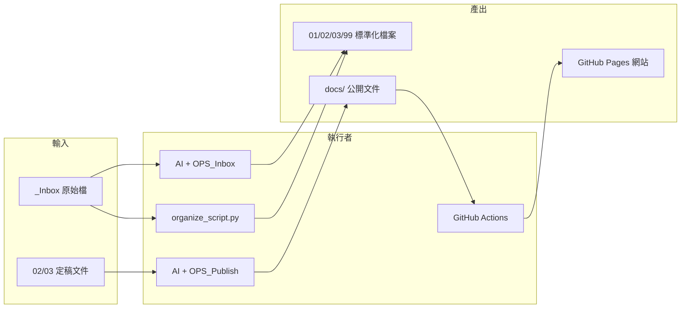

# e 化專案治理總則（母體文件）

本文件為本倉庫 **e-Consultant_SOP** 之母體治理文件，統合文件規範、目錄與工作流、檔案命名、營運手冊（OPS）與工程分工。所有在此專案下產出或維護的檔案，應符合本總則；若有衝突，以本文件為準。

---

## 1. 文件治理標準 (Documentation Governance)

### 1.1 適用範圍

所有以 Markdown (`.md`) 產出的專案文件，包含但不限於訪談紀錄、分析報告、規格書、營運手冊。

### 1.2 YAML Frontmatter（檔頭）

**必須**置於檔案最上方。本 Template Repo 以下列欄位為**必填**（與憲法、Lint 規則一致）：

```yaml
---
doc_id: "[LAYER]-[DOMAIN]-[KEY]"   # 唯一識別，見 Lint R3 格式
layer: core | standard | template | ops
domain: prd | delivery | governance | security | ...
stability: high | medium | low      # 須與 layer 對應：core→high, standard/template→medium, ops→low
visibility: internal
owner: systemlead
status: active | draft | review | deprecated
---
```

| 欄位 | 說明 |
|:---|:---|
| **doc_id** | 全 Repo 唯一；格式見 [進階治理 Lint](../index/governance_lint_report.md) R3 |
| **layer** | core / standard / template / ops |
| **domain** | prd、delivery、governance、security、api 等 |
| **stability** | 須與 layer 一致（core→high；standard、template→medium；ops→low） |
| **visibility** | Template Repo 預設 internal |
| **owner** | 負責維護者 |
| **status** | active、draft、review、deprecated |

可選（專案 Repo 或補充用）：title、type、tags、version、last_updated。專案 Repo 若沿用舊版 YAML（如 title、type、status: Draft/Review/Final），可並存但建議逐步對齊本必填集。

### 1.3 版本紀錄 (Version History)

**必須**置於文件最下方：

```markdown
## 版本紀錄
| 版本 | 日期 | 修改者 | 修改內容 |
|:---|:---|:---|:---|
| v1.0 | 202X-XX-XX | Name | 初始版本遷移 |
```

### 1.4 重構規則 (Refactoring Rules)

當對既有文件進行「標準化」時：

1. 補齊缺失的 YAML 欄位。
2. 檢查標題層級 (H1 → H2 → H3) 是否清晰。
3. 自內文提取具體日期、客戶名、痛點關鍵字至 **tags**。

---

## 2. 目錄結構與工作流 (Folder Structure & Workflow)

註：以下目錄結構為「專案 Repo（由本 Template Repo clone 後）」建議工作區；本 Template Repo 本身僅包含 core/standards/templates/ops/index/_archive。

### 2.1 目錄定義

| 目錄 | 階段 | 用途 | 產出類型 |
|:---|:---|:---|:---|
| **00_Templates** | 範本庫 | 新文件範本、治理總則參照 | 範本、GOV 參照 |
| **01_Discovery** | 診斷期 | 訪談筆記、現況 (As-Is)、痛點 | 訪談紀錄、需求摘要 |
| **02_Analysis** | 分析期 | 流程圖、瓶頸分析、To-Be 設計 | Mermaid 流程、分析報告 |
| **03_Solution** | 處方期 | PRD、SOW、報價、驗收標準 | 規格書、工作說明書 |
| **99_Archives** | 歸檔 | 過期、無效或暫存後不需即時使用 | 歷史版本、廢棄草案 |
| **docs/** | 對外發布 | 經清洗後對外公開之文件（MkDocs 建置來源；**僅放可對外內容**） | 手冊、公開說明 |
| **internal_docs/** | 對內 | 公司標準、協作規範、程式編碼、提交步驟等；**與 docs 同層，不放在 docs 下**，避免 MkDocs 開放權限 | 規範、Runbook、索引 |
| **_Inbox/** | 待處理 | 未分類原始檔，待執行歸檔後清空 | 暫存 |

### 2.2 工作流原則

- **先 Why 再 What：** 先釐清目的，再產出規格或流程。
- **流程視覺化：** 遇流程描述時，以 Mermaid 產出流程圖。
- **新文件優先參考：** 從本 Template Repo 之 `templates/`（或專案 Repo 之 `00_Templates`）選擇對應範本再撰寫。

### 2.3 流程與內部標準（需求→交付包）

從**公司背景／需求**到**釋出協助開發包給工程師以 AI 協作開發**之完整生命週期與手off，見 [需求到交付包_生命週期與流程總覽](需求到交付包_生命週期與流程總覽.md)（本 Template Repo 於 core/；專案 Repo 於 internal_docs/）。公司標準、協作規範、程式編碼、交付包結構與產出步驟於**本 Template Repo** 以 **core/** 與 **index/00_overview.md** 為治理入口；於**專案 Repo** 以 internal_docs/ 為單一真相來源；_Inbox 內待歸檔檔案，歸檔後以 internal_docs 為準，避免雙版本並存。

---

## 3. 檔案命名規範 (File Naming Convention)

### 3.1 標準格式

註：本 Template Repo 內檔名不含日期／版本；以下格式僅適用專案 Repo。

```
YYYYMMDD_類型_關鍵字.md
```

**範例（專案 Repo）：**

- `20240115_訪談_宏達財務流程.md`
- `20240220_規格_API介接定義.md`
- `20240209_分析_發票開立To-Be流程.md`

### 3.2 歸類邏輯 (Classify Logic)

| 內容性質 | 歸屬目錄 |
|:---|:---|
| 客戶需求、抱怨、現況 | `01_Discovery` |
| 流程圖、痛點分析、架構 | `02_Analysis` |
| 功能列表、SOW、報價、驗收 | `03_Solution` |
| 無法判斷或過期資料 | `99_Archives` |

---

## 4. 營運手冊 (OPS Runbooks) 參照

以下為專案內已定義之 **OPS 執行手冊**，供人員或 AI 依步驟執行。

### 4.1 OPS_Inbox_AutoSorter（收件匣自動歸檔）

- **目的：** 清空 `_Inbox/`，將檔案標準化後移動至正確目錄。
- **要點：**
  - 掃描 `_Inbox/`，依內容判斷歸屬 (Discovery / Analysis / Solution / Archives)。
  - 新檔名依 `YYYYMMDD_類型_關鍵字.md`。
  - 補上 YAML Frontmatter，必要時轉為 Markdown。
  - 產出可重複執行之 **Python 腳本** (`organize_script.py`) 處理讀取、加檔頭、寫入目標、刪除來源。
- **詳見：** [OPS_Inbox_AutoSorter.md](./OPS_Inbox_AutoSorter.md)

### 4.2 OPS_Publish_To_Web（文件發布至網站）

- **目的：** 將 `02_Analysis` 或 `03_Solution` 之定稿文件，清洗敏感資訊後發布至 `docs/`，供 MkDocs 產生網站。
- **要點：**
  - 來源由使用者指定（如 `@PRD.md`）。
  - **清洗與轉換：** 移除內部備註、成本分析；精簡 YAML（如移除 `owner`, `status`）；檢查 Mermaid 語法；調整標題層級以利網頁閱讀。
  - 歸檔至 `docs/` 對應子目錄；若無 `docs/index.md` 則生成目錄頁。
- **詳見：** [OPS_Publish_To_Web.md](./OPS_Publish_To_Web.md)

---

## 5. 工程分工 (Engineering Division of Labor)

以下定義 **誰在什麼情境下做什麼**，以明確責任邊界並可重複執行。

### 5.1 角色與責任

| 角色 | 責任 | 典型產物 |
|:---|:---|:---|
| **顧問 / 專案負責人** | 訪談、需求確認、驗收、決定發布範圍與敏感資訊邊界 | 訪談紀錄、PRD 審核、發布清單 |
| **AI 助理 (Cursor / 依 .cursorrules)** | 依總則與 OPS 執行：歸檔、重構、加 YAML、產出 Mermaid、清洗並轉換發布文件 | 標準化 .md、流程圖程式碼、`docs/` 草稿 |
| **自動化腳本** | 可重複執行之 Inbox 歸檔（如 `organize_script.py`） | 歸檔後之檔案與清空的 _Inbox |
| **CI (GitHub Actions)** | 於 push to `main` 時建置 MkDocs 並部署至 GitHub Pages | 對外網站 |

### 5.2 流程與觸發條件



### 5.3 分工原則

- **治理與範本：** 由專案負責人維護；本總則與本 Template Repo 之 `templates/`（專案 Repo 之 `00_Templates`）為單一真相來源。
- **歸檔與發布：** 依 OPS 手冊執行；AI 或腳本不得擅自變更 OPS 定義之步驟，若有優化建議應先更新 OPS 與本總則。
- **對外發布：** 僅經「清洗」且經負責人確認之內容可放入 `docs/` 並由 CI 部署。

---

## 6. 互動指令 (Interaction Shortcuts)

| 指令 | 說明 |
|:---|:---|
| `/start` | 詢問客戶名稱與專案類型，並建議使用的範本。 |
| `/draw` | 依當前對話內容產出 Mermaid 流程圖代碼。 |

---

## 7. 相關檔案索引

| 檔案 | 說明 |
|:---|:---|
| [.cursorrules](./.cursorrules) | AI 行為準則、語言、格式、目錄與命名（與本總則一致）。 |
| [需求到交付包_生命週期與流程總覽](需求到交付包_生命週期與流程總覽.md) | **需求→RFP→PRD→程式編碼→雛型→交付包→釋出** 完整流程與手off；各階段產出與關鍵文件索引（本 Repo 於 core/）。 |
| [index/00_overview.md](../index/00_overview.md)、[readme_internal_docs](readme_internal_docs.md) | 本 Template Repo 治理入口與 core 總覽；專案 Repo 之單一真相來源為 internal_docs/。 |
| [GOV_Inbox_歸檔審視與建議](../ops/gov_inbox_歸檔審視與建議.md) | _Inbox 依範本方式之歸檔審視與建議、目錄結構。 |
| [OPS_Inbox_AutoSorter](../ops/ops_inbox_autosorter.md) | Inbox 自動歸檔執行手冊。 |
| [OPS_Publish_To_Web](../ops/ops_publish_to_web.md) | 文件發布至網站執行手冊。 |
| [templates/](../templates/) | 訪談、RFP、PRD、交付包、驗收、需求變更等範本。 |
| 01_Discovery／02_Analysis | 專案 Repo 之診斷期／分析期產出目錄；本 Template Repo 不包含此二目錄。 |
| [mkdocs.yml](./mkdocs.yml) | MkDocs 站台設定。 |
| [.github/workflows/publish.yml](./.github/workflows/publish.yml) | GitHub Pages 部署流程。 |

---

## 8. 改善建議 (Recommendations)

以下為依目前專案狀態所整理之建議，可作為後續迭代依據。

### 8.1 目錄與實作

| 建議 | 說明 | 優先級 |
|:---|:---|:---|
| **建立實體目錄** | `01_Discovery`、`02_Analysis` 已可含 README 建立；若尚未建立 `03_Solution`、`99_Archives`、`_Inbox`，請新增使 OPS 與歸類邏輯可實際運作。 | 高 |
| **實作 organize_script.py** | 依 OPS_Inbox_AutoSorter 產出並測試 Python 歸檔腳本，必要時可加入「乾跑 (dry-run)」模式。 | 高 |
| **補齊 docs 結構** | 為 `docs/index.md` 撰寫正式目錄內容，並在 `mkdocs.yml` 中設定 `site_url` 與 `nav`，讓發布後網站可導覽。 | 中 |

### 8.2 治理與一致性

| 建議 | 說明 | 優先級 |
|:---|:---|:---|
| **.cursorrules 與總則同步** | 本總則為母體；若未來修改命名、目錄或 type 定義，請同步更新 `.cursorrules`，避免 AI 與人工解讀不一致。 | 高 |
| **OPS 也加 YAML** | 為 `OPS_Inbox_AutoSorter.md`、`OPS_Publish_To_Web.md` 補上 YAML Frontmatter 與版本紀錄，符合自身治理標準。 | 中 |
| **敏感資訊清單** | 在 OPS_Publish_To_Web 或本總則中新增「敏感資訊關鍵字/章節清單」，供發布前檢查與 AI 清洗時依循。 | 中 |

### 8.3 工程與自動化

| 建議 | 說明 | 優先級 |
|:---|:---|:---|
| **發布前檢查** | 在 CI 或本地預設「僅部署 `docs/` 且不含特定關鍵字」的檢查（如 grep 或簡單腳本），降低誤發風險。 | 低 |
| **範本補完** | `templates/tpl_solution_spec.md` 內 Mermaid 區塊未閉合，建議補齊並新增「分析報告」範本。 | 中 |
| **單一入口** | 治理總則請見本文件；本 Template Repo 入口見 [index/00_overview.md](../index/00_overview.md)。專案 Repo 可於 README 或 docs/index.md 註明。 | 中 |

### 8.4 後續可選

- 為不同 **客戶或專案** 建立子資料夾（如 `01_Discovery/客戶A/`），再依總則命名與歸檔。
- 若有多位顧問協作，可在 YAML 新增 `reviewer` 或將 `owner` 改為清單格式。
- 考慮將本總則納入 `docs/` 的「內部/對外」分流：對外版可僅保留公開章節（如 1.1–1.3、2.1、3.1、6），其餘保留在倉庫根目錄供內部使用。

---

## 版本紀錄

| 版本 | 日期 | 修改者 | 修改內容 |
|:---|:---|:---|:---|
| v1.0 | 2025-02-09 | 專案負責人 | 初始版本：整合 .cursorrules、OPS 手冊與工程分工，建立母體治理總則；並新增改善建議章節。 |
| v1.1 | 2026-02-23 | AI | 新增 §2.3 流程與內部標準；§7 索引補 internal_docs、生命週期總覽、01_Discovery／02_Analysis；§8.1 目錄建議更新；標註 internal_docs 為單一真相來源。 |
