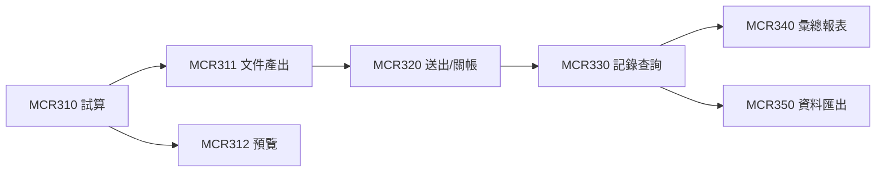

# MCR 工程請款結算｜程式清單建議

- **日期：** 2026-02-14
- **用途：** 列出 MCR 工程請款結算相關程式清單，供開發排程與交付包規劃使用
- **編碼原則：** 依據程式編碼原則共用規範

---

## 1. 程式清單總覽

| 程式代號 | 程式名稱 | 類型 | 優先級 | 階段 | 狀態 |
|---|---|---|---|---|---|
| MCR310 | 請款試算作業 | 線上作業 | 高 | P2 | 開發中 |
| MCR311 | 請款文件產出 | 批次/線上 | 高 | P2 | 規劃中 |
| MCR312 | 請款文件預覽 | 線上作業 | 中 | P2 | 規劃中 |
| MCR320 | 請款送出與關帳 | 線上作業 | 高 | P2 | 規劃中 |
| MCR330 | 請款記錄查詢 | 線上查詢 | 中 | P2 | 規劃中 |
| MCR340 | 請款彙總報表 | 報表 | 中 | P2 | 規劃中 |
| MCR350 | 請款資料匯出 | 批次 | 低 | P2 | 評估中 |

---

## 2. 各程式功能說明

### 2.1 MCR310 請款試算作業

- **功能：** 依篩選條件計算請款金額
- **輸入：** 合約編號、工地、日期範圍、工序狀態篩選
- **處理：** 彙算已核定工序之數量與金額
- **輸出：** 試算結果清單（含明細與彙總）
- **規則：**
  - 僅核定（Approved）狀態的工序可納入
  - PhotoPending 的工序可納入試算
  - 已關帳的工序不可重複計算
- **雛型：** [MCR310 雛型](../docs/prototype/2026-02-26_prototype_MCR310.html)

### 2.2 MCR311 請款文件產出

- **功能：** 依試算結果產出正式請款文件
- **輸入：** 試算結果 ID
- **處理：** 產出 PDF/Excel 格式請款文件
- **輸出：** 請款文件檔案
- **規則：**
  - 產出時記錄篩選條件與時間戳（快照）
  - 支援重新產出但保留前版紀錄
  - 文件含浮水印「正式」或「草稿」

### 2.3 MCR312 請款文件預覽

- **功能：** 在送出前預覽請款文件內容
- **輸入：** 試算結果 ID 或文件 ID
- **處理：** 即時渲染預覽
- **輸出：** 畫面顯示
- **規則：** 預覽不產生正式文件

### 2.4 MCR320 請款送出與關帳

- **功能：** 送出正式請款文件並執行關帳
- **輸入：** 請款文件 ID
- **處理：**
  1. 檢核文件完整性
  2. 送出請款文件
  3. 更新 billing_status 為 Submitted
  4. 執行關帳 → is_locked = true, close_date = now()
- **規則：**
  - 關帳後不可變更任何資料
  - 需專案經理確認後方可執行

### 2.5 MCR330 請款記錄查詢

- **功能：** 查詢歷史請款記錄
- **篩選條件：** 合約、工地、日期範圍、狀態
- **顯示欄位：** 請款單號、合約、工地、金額、狀態、關帳日

### 2.6 MCR340 請款彙總報表

- **功能：** 依期間產出請款彙總統計
- **維度：** 依合約、依工地、依月份
- **格式：** 線上檢視 + Excel 匯出

### 2.7 MCR350 請款資料匯出

- **功能：** 批次匯出請款資料供外部系統使用
- **格式：** CSV / Excel
- **排程：** 可手動觸發或排程執行

---

## 3. 程式間依賴

---

## 4. 開發順序建議

| 順序 | 程式 | 原因 |
|---|---|---|
| 1 | MCR310 | 核心計算邏輯，其他程式依賴 |
| 2 | MCR312 | 預覽可驗證試算正確性 |
| 3 | MCR311 | 正式文件產出 |
| 4 | MCR320 | 送出與關帳需文件產出完成 |
| 5 | MCR330 | 查詢為獨立功能 |
| 6 | MCR340 | 報表依賴記錄資料 |
| 7 | MCR350 | 優先級最低，可延後 |

---

## 5. 相關文件

- [PRD_立國工程_MCR_第二階段](PRD_立國工程_MCR_第二階段.md)
- [MCR_請款流程_參考](MCR_請款流程_參考.md)
- [表單與名詞對照清單_欄位引用標準](表單與名詞對照清單_欄位引用標準.md)
- [工程回報_請款_吊車調派_泳道圖](工程回報_請款_吊車調派_泳道圖.md)
