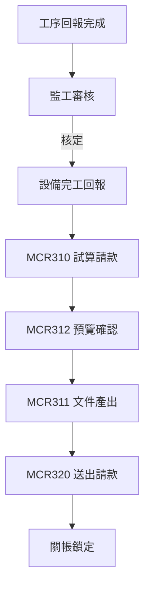

# MCR 請款流程｜參考

- **日期：** 2026-02-12
- **用途：** 整理 MCR 請款流程之參考資訊，包含現行作業方式、系統化流程對比與關鍵決策點

---

## 1. 現行請款作業（As-Is）

### 1.1 流程概述

1. 現場人員完成工序回報（含拍照）
2. 監工審核回報內容
3. PM 彙整已核定工序，以 Excel 試算請款金額
4. PM 製作請款文件（Word / Excel）
5. 主管簽核後送出
6. 會計確認收款

### 1.2 痛點

| 痛點 | 說明 | 影響 |
|---|---|---|
| 人工彙整 | PM 需逐筆核對已核定工序 | 耗時、易錯 |
| 文件不一致 | 每次產出格式可能不同 | 客戶抱怨 |
| 無法追溯 | 文件產出條件未記錄 | 爭議時無據 |
| 關帳不明確 | 無明確關帳時點 | 資料可被事後修改 |

---

## 2. 系統化請款流程（To-Be）

### 2.1 流程概述

### 2.2 關鍵改善

| 改善項目 | 說明 |
|---|---|
| 自動試算 | 系統依核定工序自動計算金額 |
| 條件篩選 | 支援依工序欄位篩選產出範圍 |
| 快照紀錄 | 產出時記錄篩選條件與時間戳 |
| 明確關帳 | 送出後方可關帳，關帳後鎖定 |

---

## 3. 關鍵決策點

| 編號 | 決策 | 結論 | 依據 |
|---|---|---|---|
| D-B01 | PhotoPending 可否進入請款？ | 可 | 與拍照流程分線 |
| D-B02 | 關帳後可否更正？ | 不可 | 合約關帳 |
| D-B03 | 文件重新產出是否覆蓋前版？ | 不覆蓋，保留歷史 | 追溯需求 |
| D-B04 | 關帳前置條件？ | 需先送出請款文件 | 客戶確認 |
| D-B05 | 設備完工回報可否重開？ | 可（關帳前） | 客戶確認 |

---

## 4. 請款文件內容規格

| 項目 | 說明 |
|---|---|
| 封面 | 合約資訊、工地名稱、請款期間 |
| 工序明細 | 工序編號、名稱、數量、單價、金額 |
| 照片附件 | 已核定工序之照片（依 photo_status 篩選） |
| 彙總表 | 分類小計與總計 |
| 篩選條件 | 產出時之篩選參數紀錄 |
| 浮水印 | 草稿 / 正式 |

---

## 5. 相關文件

- [PRD_立國工程_MCR_第二階段](PRD_立國工程_MCR_第二階段.md)
- [MCR_工程請款結算_程式清單建議](MCR_工程請款結算_程式清單建議.md)
- [工程規格草案_MCR_第二階段](../03_Solution/工程規格草案_MCR_第二階段.md)
- MCR SOP 作業辦法（參見 docs/MCR/SOP）
- [表單與名詞對照清單_欄位引用標準](表單與名詞對照清單_欄位引用標準.md)
