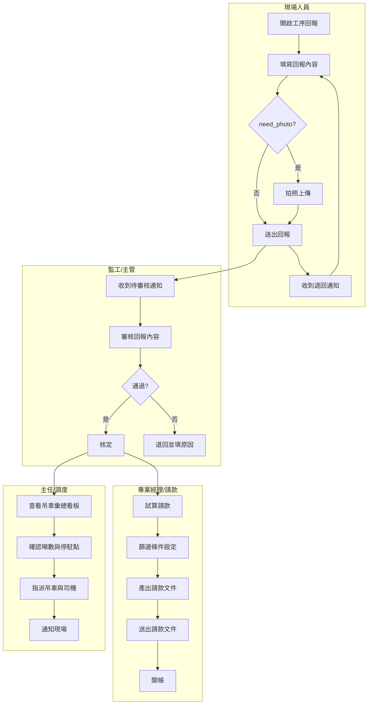

# 工程回報 × 請款 × 吊車調派｜泳道圖（含 SOP 對應）

- **日期：** 2026-02-12
- **用途：** 以泳道圖呈現工程回報、請款文件產出、吊車調派三大流程之角色分工與 SOP 對應

---

## 1. 泳道圖總覽

---

## 2. SOP 對應表

| 流程階段 | SOP 編號 | SOP 名稱 | 負責角色 | 對應程式 |
|---|---|---|---|---|
| 工序回報 | SOP-201 | 現場工序回報作業 | 現場人員 | MCR210 |
| 照片上傳 | SOP-202 | 回報照片拍攝與上傳 | 現場人員 | MCR210 |
| 回報審核 | SOP-203 | 回報審核與退回 | 監工/主管 | MCR220 |
| 設備完工回報 | SOP-204 | 設備完工通知 | 現場/PM | MCR210A |
| 試算請款 | SOP-301 | 請款試算與文件產出 | PM/請款 | MCR310 |
| 送出請款 | SOP-302 | 請款文件送出 | PM | MCR310 |
| 關帳 | SOP-303 | 請款關帳作業 | PM/主管 | MCR320 |
| 吊車彙總 | SOP-401 | 吊車排程彙總看板 | 主任 | MCR410 |
| 吊車派車 | SOP-402 | 吊車調派與通知 | 主任/調度 | MCR420 |

---

## 3. 角色與責任矩陣（RACI）

| 活動 | 現場人員 | 監工/主管 | PM/請款 | 主任/調度 |
|---|---|---|---|---|
| 工序回報 | R | I | I | — |
| 拍照上傳 | R | I | — | — |
| 回報審核 | I | R/A | I | — |
| 退回補件 | R | A | — | — |
| 試算請款 | — | C | R | — |
| 文件產出 | — | — | R/A | — |
| 關帳 | — | A | R | — |
| 吊車彙總 | — | — | I | R |
| 吊車調派 | I | — | — | R/A |

> R = Responsible, A = Accountable, C = Consulted, I = Informed

---

## 4. 流程間依賴

| 上游流程 | 下游流程 | 觸發條件 | 資料傳遞 |
|---|---|---|---|
| 工序回報 | 回報審核 | 回報送出 | 回報記錄 + 照片 |
| 回報審核（核定） | 試算請款 | 核定完成 | 核定工序清單 |
| 回報審核（核定） | 吊車彙總 | 核定且含吊車工序 | crane_tonnage / parking_zone_group |
| 試算請款 | 送出請款 | 試算確認 | 請款文件 |
| 送出請款 | 關帳 | 文件送出 | 關帳觸發 |

---

## 5. 相關文件

- [工程規格草案_MCR_第二階段](../03_Solution/工程規格草案_MCR_第二階段.md)
- [表單與名詞對照清單_欄位引用標準](表單與名詞對照清單_欄位引用標準.md)
- 專案進行進度（參見 internal_docs）
- [第二階段_流程圖](第二階段_流程圖.md)
- [PRD_立國工程_MCR_第二階段](PRD_立國工程_MCR_第二階段.md)
