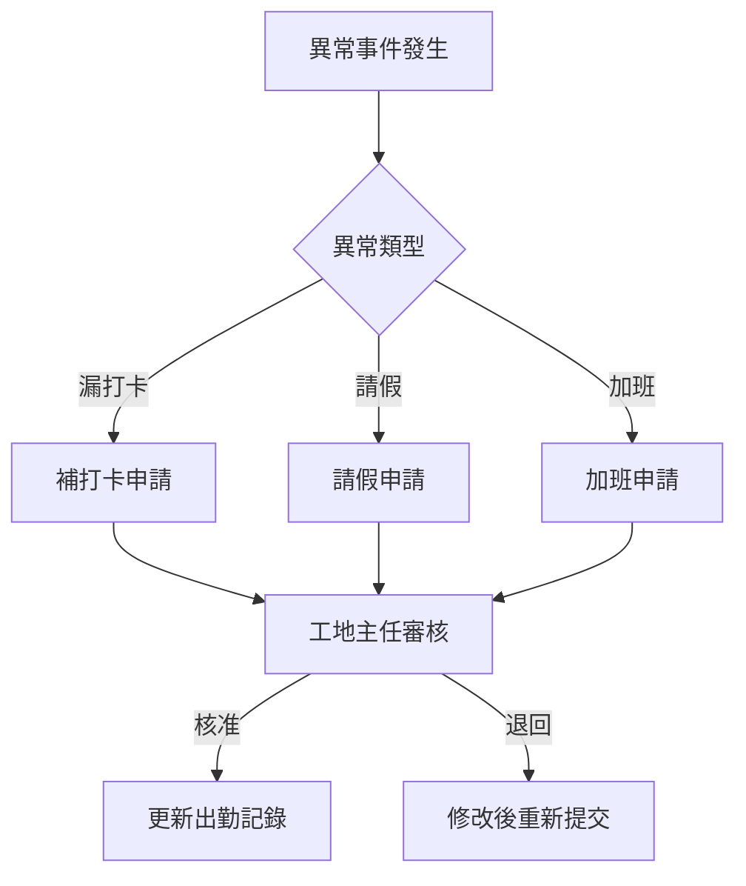

# 簡報大綱｜出缺勤系統－客戶確認用

- **日期：** 2026-02-20
- **用途：** 出缺勤系統規劃簡報大綱，用於向客戶說明系統範圍、功能架構與導入規劃
- **對象：** 立國工程管理層、人資主管
- **預估時間：** 30–40 分鐘

---

## 投影片 1：封面

- **標題：** 出缺勤管理系統｜規劃說明
- **副標題：** 人臉辨識 × 指紋辨識雙模式
- **日期與簡報者**

---

## 投影片 2：議程

1. 現況與痛點
2. 系統目標與效益
3. 功能架構總覽
4. 打卡方式說明
5. 班表與排班
6. 異常處理流程
7. 報表與統計
8. 硬體與部署
9. 導入時程
10. Q&A

---

## 投影片 3：現況與痛點

**目前管理方式：**
- 紙本簽到 / 傳統打卡鐘
- 各工地獨立管理，總部彙整困難
- 月底人工核算出勤

**主要痛點：**
- 代打卡無法防範
- 多工地人員到勤無法即時掌握
- 月報產出耗時（約 3 天）
- 紙本保存與稽核不便

---

## 投影片 4：系統目標與效益

| 目標 | 預期效益 |
|---|---|
| 杜絕代打卡 | 人臉＋指紋雙重驗證 |
| 即時到勤 | 打卡後 5 秒內可見 |
| 自動化報表 | 月報由 3 天縮短至即時 |
| 合規管理 | 符合勞基法工時規範 |
| 多工地統一 | 單一平台管理所有工地 |

---

## 投影片 5：功能架構總覽

```
出缺勤系統
├── 打卡模組
│   ├── 人臉辨識（含活體偵測）
│   └── 指紋辨識（備援）
├── 班表管理
│   ├── 班別定義
│   ├── 排班作業
│   └── 換班／加班申請
├── 異常處理
│   ├── 補打卡申請
│   ├── 請假申請
│   └── 出差登記
├── 報表中心
│   ├── 即時到勤看板
│   ├── 日報／月報
│   └── 異常分析
└── 系統管理
    ├── 人員建檔
    ├── 裝置管理
    └── 權限設定
```

---

## 投影片 6：打卡方式說明

**主要模式：人臉辨識**
- 近紅外線（NIR）技術
- 活體偵測（防照片攻擊）
- 支援安全帽、口罩場景
- 辨識時間 ≤ 1 秒

**備援模式：指紋辨識**
- 光學式感應器
- IP65 防水防塵（工地環境）
- 人臉辨識失敗時自動提示切換

**離線支援：**
- 網路中斷時本地暫存
- 恢復後自動上傳
- 離線暫存容量 ≥ 7 天

---

## 投影片 7：班表與排班

**支援班別：**
- 固定班（日班 08:00–17:00）
- 二班制 / 三班制（輪班）
- 彈性班（核心時段＋彈性區間）

**排班功能：**
- 按工地 / 專案 / 角色排班
- 提前 7 天發布
- 換班需申請審核

**合規提醒：**
- 每日工時上限警示
- 連續工作天數警示
- 加班時數累計提醒

---

## 投影片 8：異常處理流程



**處理時效目標：** ≤ 1 個工作日

---

## 投影片 9：報表與統計

**即時看板：**
- 各工地到勤率（圓餅圖）
- 今日遲到 / 未到清單
- 裝置連線狀態

**定期報表：**
- 月出勤明細（個人）
- 月彙總統計（工地 / 全公司）
- 異常次數排行
- 加班時數統計

**匯出格式：** Excel / PDF / CSV

**薪資對接：** 可匯出符合薪資模組規格之計算資料

---

## 投影片 10：硬體與部署

**打卡裝置：**
- 7 吋觸控螢幕
- IP65 防護等級
- Wi-Fi / 4G / 有線網路
- 工作溫度 -10°C ~ 50°C

**部署方式：**
- 雲端部署（Azure 建議）
- 或客戶機房自建

**建議配置：**
- 每工地入口設置 1–2 台
- 大型工地可增設移動式裝置

---

## 投影片 11：導入時程（建議）

| 階段 | 內容 | 預估時間 |
|---|---|---|
| Phase 1 | 需求確認＋硬體評估 | 2 週 |
| Phase 2 | 系統開發＋裝置採購 | 8 週 |
| Phase 3 | 人員建檔＋裝置安裝 | 2 週 |
| Phase 4 | 試運行（1 個工地） | 2 週 |
| Phase 5 | 全面上線＋教育訓練 | 2 週 |

**總計：** 約 16 週

---

## 投影片 12：待確認事項

1. **工地數量與規模：** 需設置打卡裝置的工地清單
2. **班別需求：** 各工地實際班別類型
3. **薪資模組規格：** 匯出對接格式確認
4. **網路環境：** 各工地網路可用性
5. **預算範圍：** 硬體採購與系統建置預算

---

## 投影片 13：Q&A

- 預留 10 分鐘問答時間
- 會後提供書面回覆

---

## 相關文件

- [PRD_出缺勤系統](PRD_出缺勤系統.md)
