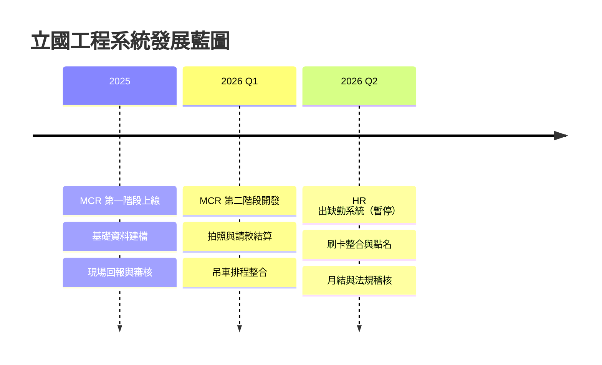

# 系統範圍與階段規劃

## MCR 工程維護管理系統

### 第一階段（已完成）
- 廠區、設備、型號工序、合約、案件建檔
- 現場回報、審核、成果報表、進度追蹤

### 第二階段（進行中）
- 工程回報拍照、請款結算
- 基本資料批次匯入
- 吊車排程（暫停中）

## HR 出缺勤系統（暫停中）
- 刷卡匯入與出勤判斷
- 點名輔助、月結算、法規稽核

## 階段藍圖

```mermaid
timeline
    title 立國工程系統發展藍圖
    2025 : MCR 第一階段上線
         : 基礎資料建檔
         : 現場回報與審核
    2026 Q1 : MCR 第二階段開發
            : 拍照與請款結算
            : 吊車排程整合
    2026 Q2 : HR 出缺勤系統（暫停）
            : 刷卡整合與點名
            : 月結與法規稽核
```
